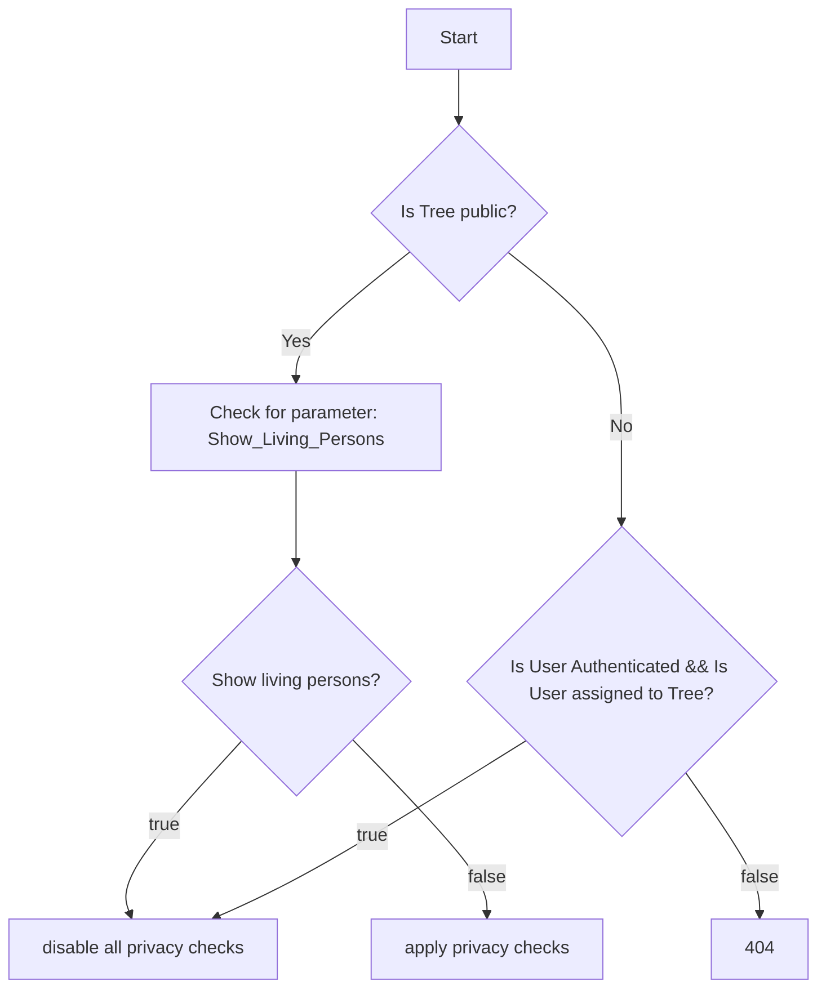
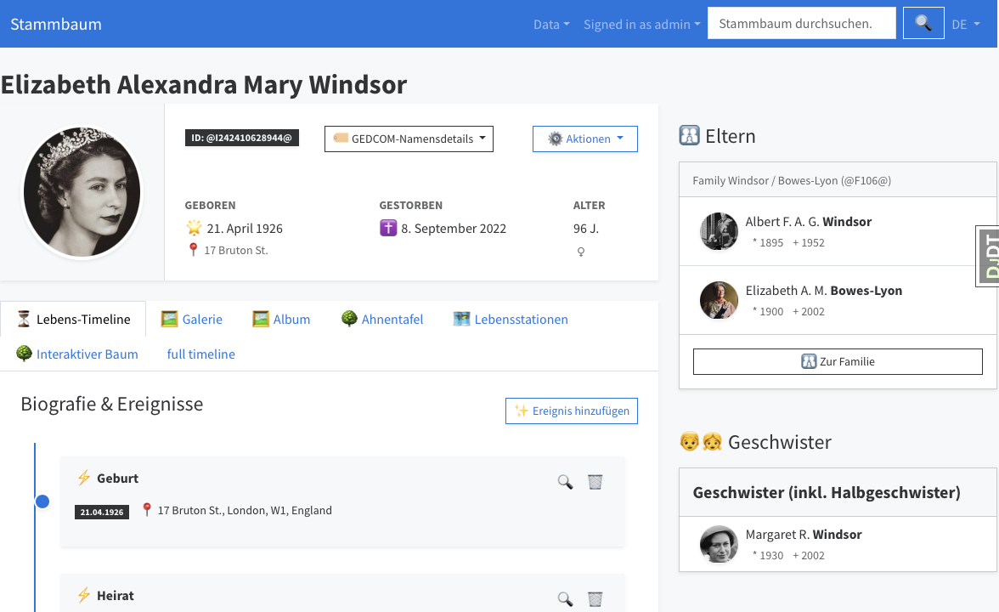
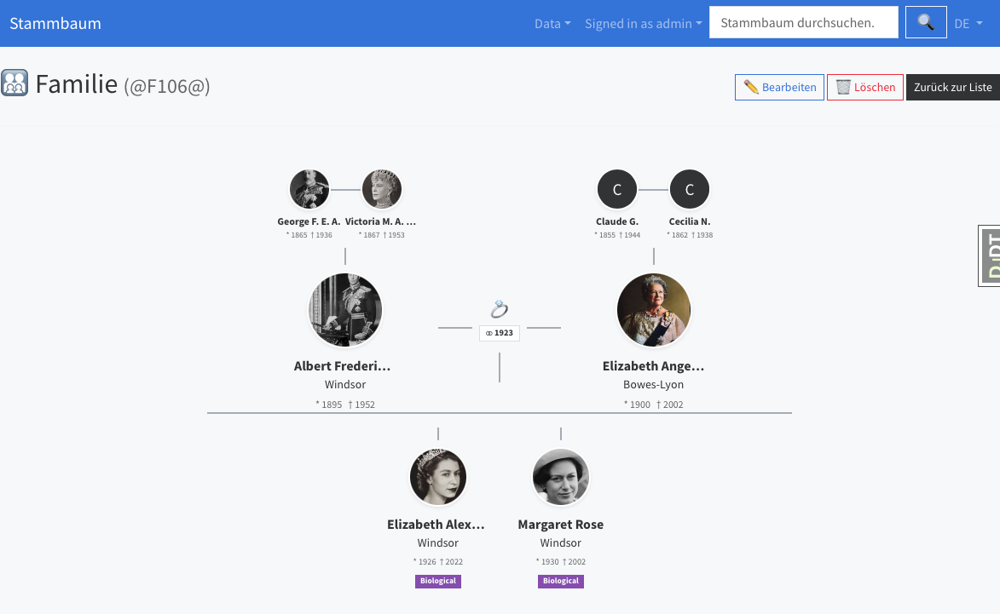
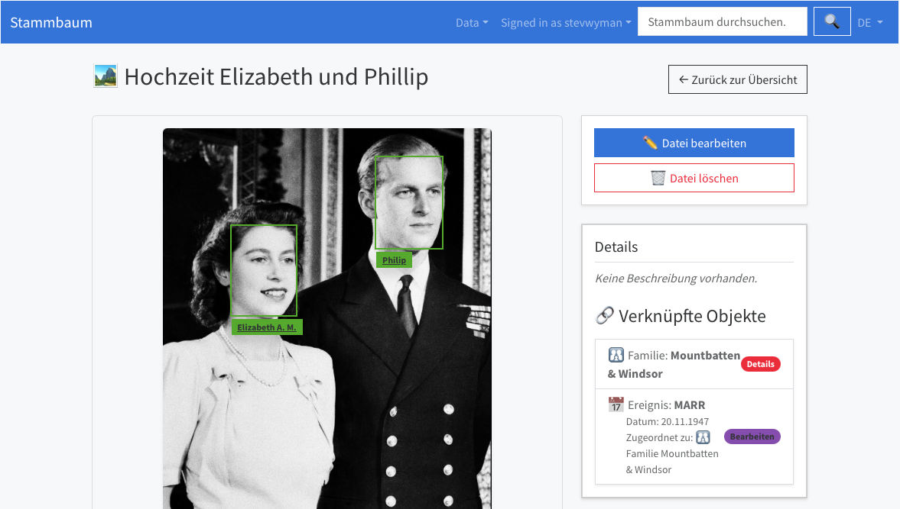

# RootNode


A simple gedcom based management for family trees based on Django framework and bootstrap. Ready to run in a container. Additional plugins/microservices to enable AI features.

## Main features

- gedcom file import (web and cli)
- modification of data
- media management
- two factor authorization
- multi language support

### AI plugins

- Colorize black/white photos, use [colornode](https://github.com/stevwyman/colornode)
- Chat with the app to get information from your tree,use [parsenode](https://github.com/stevwyman/parsenode)
- Recognize individuals on photos and get suggestions based on your tree, use [facenode](https://github.com/stevwyman/facenode)
- Read image/pdf and extract text, currently only machine text, no handwriting, still use [textnode](https://github.com/stevwyman/textnode)

All of the plugins can be en-/disabled by an admin-role. See below [components role](#Component Roles).

### Privacy

The main driver of initiating this project has been to focus on security. This type of information can be very sensitive and therefore **privacy** needs attention. On the other hand you want to share as much as possible to either help others or to get others information, if they have same.

Therefore we have images that can be marked as private, but trees can be marked as public. A second tree flag, **show living people**, controls whether public visitors see living persons. When a public tree does not show living people, visitors only see information that complies with:

- do not show birth events within the prior 110 years
- do not show death events within the prior 30 years
- do not show marriage events within the prior 80 years
- do not show individuals or families where one of the above rules is active

Private-tree members (including viewers) always see living people. Editors and admins bypass privacy even on a public tree with the living-people flag off. Unauthorized access to a private tree returns 404.









## usage

```sh
python manage.py import_gedcom pfad/zur/datei.ged --tree-name "Familie Müller"
```

## architecture

This section outlines the architecture, communication flow, and data storage strategy for the containerized application stack.

### 1. System Overview & Communication

The system utilizes a **Hub-and-Spoke** microservices architecture. The containers communicate over an internal network, with only the main application exposed to the end user.

```text
 ┌─────────────────────────────────────────────────────────────────────────┐
 │                            User / Web Browser                           │
 └────────────────────────────────────┬────────────────────────────────────┘
                                      │ HTTP Request
                                      ▼ (Port 8079 maps to internal 8003)
 ┌─────────────────────────────────────────────────────────────────────────┐
 │                              ROOTNODE                                   │
 │                     (Public Facing / Main Web App)                      │
 │                                                                         │
 │  • Handles UI, Database, and Business Logic                             │
 │  • Mounts Volume: genview_data (-> /data/genview:z)                     │
 │  • Network: backend_net                                                 │
 └─────────┬──────────────────────────┬──────────────────────────┬──────────────────────────┬─────────┘
           │                          │                          │                          │
           │ API Call (Network)       │ API Call (Network)       │ API Call (Network)       │ API Call (Network)
           │                          │                          │                          │
           ▼                          ▼                          ▼                          ▼
 ┌──────────────────┐       ┌──────────────────┐       ┌──────────────────┐       ┌──────────────────┐
 │    TEXTNODE      │       │    FACENODE      │       │    COLORNODE     │       │     LLMNODE      │
 │   (Isolated)     │       │   (Isolated)     │       │   (Isolated)     │       │  (LLM Wrapper)   │
 │                  │       │                  │       │                  │       │                  │
 │ • Extracts Text  │       │ • Face Embeddings│       │ • Colorize B/W   │       │ • Formats Prompt │
 │ • EasyOCR        │       │ • DeepFace       │       │ • DDColor        │       │ • Parses Output  │
 └─────────┬────────┘       └─────────┬────────┘       └─────────┬────────┘       └─────────┬────────┘
           │                          │                          │                          │ Depends on
           │                          │                          │                          ▼
           │                          │                          │                ┌──────────────────┐
           │                          │                          │                │      OLLAMA      │
           │                          │                          │                │ (Model Executor) │
           │                          │                          │                └──────────────────┘
           ▼                          ▼                          ▼
 ┌─────────────────────────────────────────────────┐
 │            SHARED DOCKER VOLUME                 │
 │       models_data (shared_ml_models)            │
 │                                                 │
 │  • Mounted to TEXTNODE as: /app/.EasyOCR        │
 │  • Mounted to FACENODE as: /app/.deepface       │
 │  • Mounted to COLORNODE as: /app/.ddcolor       │
 └─────────────────────────────────────────────────┘
```

### Component Roles

- **Rootnode (The Hub)**: Receives the initial user request. When a user uploads a document or photo, the Rootnode holds it in memory (or saves it to its local volume) and acts as an HTTP client, delegating heavy machine-learning tasks by making POST requests to the internal endpoints of the other nodes.
- **Textnode (The OCR Spoke)**: Receives a file from the Rootnode, checks if it is a PDF or image, processes it purely in RAM, and returns a JSON string of the extracted text. It is entirely stateless.
- **Facenode (The Vision Spoke)**: Receives an image from the Rootnode, aligns the face, calculates the vector embedding, and returns a JSON payload containing facial coordinates and the 512-dimension array. It immediately forgets the image after processing.
- **Colornode (The Colorization Spoke)**: Receives an image from the Rootnode, runs DDColor, and returns a colorized JPEG. Rootnode stores that as a new media object and never overwrites the original scan.

### deployment

Right now the default configuration is based on a local db.sqlite3
You might want to provide an volume to store the database and the stored data,
such as photos or documents.

```yaml
networks:
  backend_net:
    name: genview_network

volumes:
  models_data:
    name: shared_ml_models
  genview_data:
    name: static_pictures_data

services:
  # -------------------------------------------------
  # 1️⃣ TEXTNODE (Isolated)
  # -------------------------------------------------
  textnode:
    image: localhost/textnode:latest
    container_name: textnode
    restart: unless-stopped
    volumes:
      - models_data:/app/.EasyOCR
    networks:
      - backend_net

  # -------------------------------------------------
  # 2️⃣ FACENODE (Isolated)
  # -------------------------------------------------
  facenode:
    image: localhost/facenode:latest
    container_name: facenode
    restart: unless-stopped
    volumes:
      - models_data:/app/.deepface
    networks:
      - backend_net

  # -------------------------------------------------
  # 3️⃣ COLORNODE (Isolated)
  # -------------------------------------------------
  colornode:
    image: localhost/colornode:latest
    container_name: colornode
    restart: unless-stopped
    volumes:
      - models_data:/app/.ddcolor
    networks:
      - backend_net

  # -------------------------------------------------
  # 4️⃣ ROOTNODE (Public Facing)
  # -------------------------------------------------
  rootnode:
    image: localhost/rootnode:latest
    container_name: rootnode
    restart: unless-stopped
    ports:
      - 8003:8003
    volumes:
      - genview_data:/data/genview:z
    networks:
      - backend_net
    env_file:
      - .env
    depends_on:
      - textnode
      - facenode
      - colornode

```

You can also provide configuration data using an .env file. Currently the following
parameters are supported:

```env
SECRET_KEY=django-insecure-u&zzp&ve-be0i^2ie*y!=3y_k3j_zd9q&yn!)b@g3j1rzy3pa(
ALLOWED_HOSTS=127.0.0.1
DEBUG=True

DJANGO_SUPERUSER_USERNAME=admin
DJANGO_SUPERUSER_EMAIL=admin@example.com
DJANGO_SUPERUSER_PASSWORD=admin

FACE_RECOGNITION_URL=http://facenode:8000/detect
OCR_RECOGNITION_URL=http://textnode:8000/extract
COLORIZE_URL=http://colornode:8000

# Optional Phase-2 parser (Ollama chat API, or a wrapper ending in /parse)
TREE_QUERY_LLM_URL=http://localhost:11434
TREE_QUERY_LLM_MODEL=llama3.2:3b
# TREE_QUERY_LLM_API_KEY=
# Set TREE_QUERY_LLM_URL=off to disable the model and use rule-based phrases only.
```

## ToDos

## some tweaks

### hashed subfolders thumbs

As we have multiple small and mini thumbnail images in the different pages, we are using hashed folders.

```sh
python manage.py generate_thumbnails
````

Use --all to regenerate everything, or --tree-id 2 to limit scope. After that you should see files under thumbs/mini|small/<aa>/<bb>/ and paths filled in the MediaObject fields

### global tree view

we have two different approaches to handle the tree view, here are two different javascript to render the tree either by merging new data, or by replacing. Both are triggered by double-click.

#### replacing

```js
<script type="module">
document.addEventListener('DOMContentLoaded', function () {
    const language     = "{{ LANGUAGE_CODE|lower }}";
    const appName      = "genview";
    const treeId       = {{ tree_id }};
    const startDepth   = 4; // Hier kannst du jetzt ruhig wieder 3 oder 4 nehmen!

    const messageDiv = document.getElementById('chart-message');
    const chartContainer = document.getElementById('FamilyChart');
    let f3Chart = null;

    function showError(msg) {
        messageDiv.innerHTML = `<p class="text-danger">${msg}</p>`;
    }

    function buildUrl(personId, depth) {
        return `/${language}/${appName}/tree/${treeId}/individual/${personId}/json/?max_depth=${depth}`;
    }

    // --- Die Lade-Funktion ersetzt jetzt rigoros die alten Daten ---
    function loadTree(personIdToLoad, depth) {
        messageDiv.innerHTML = '<span class="text-info"></span>';

        fetch(buildUrl(personIdToLoad, depth), { credentials: 'same-origin' })
            .then(resp => {
                if (!resp.ok) throw new Error(`Server-Antwort ${resp.status}`);
                return resp.json();
            })
            .then(newData => {
                if (newData.error) throw new Error(newData.error);

                messageDiv.innerHTML = ''; 

                // 1. Tabula Rasa: Wir löschen den kompletten alten D3/SVG-DOM!
                // (Unser Doppelklick-Listener überlebt, da er am Container-Div hängt)
                chartContainer.innerHTML = '';

                // 2. Chart komplett neu aufbauen
                f3Chart = f3.createChart('#FamilyChart', newData);
                
                f3Chart.setCardHtml()
                    .setCardDisplay([
                        ["first name", "last name"],
                        ["birthday"]
                    ]);

                // 3. Baum rendern (zentriert sich automatisch auf die root-Person)
                f3Chart.updateTree({initial: true});
                
                // --- PRO-TIPP: Browser-Historie updaten ---
                // Ändert die URL in der Adresszeile ohne die Seite neu zu laden.
                // So kann der Nutzer ein Lesezeichen der Ansicht speichern!
                const newViewUrl = `/${language}/${appName}/tree/${treeId}/individual/${personIdToLoad}/view/`;
                window.history.pushState({ personId: personIdToLoad }, "", newViewUrl);
            })
            .catch(err => {
                console.error(err);
                showError('<br>' + err.message);
            });
    }

    // --- Interaktion: Rechtsklick (Context Menu) - Ultimative __data__ Methode ---
    chartContainer.addEventListener('contextmenu', function(e) {
        
        // 1. Standard-Menü blockieren
        e.preventDefault();
        e.stopPropagation();

        // 2. Wir starten beim exakt geklickten Element (z.B. dem Namen oder Bild)
        let currentElement = e.target;
        let clickedPersonId = null;

        // 3. Wir klettern den DOM-Baum nach oben, bis wir den Container erreichen
        while (currentElement && currentElement !== chartContainer) {
            
            // D3 speichert seine Magie in der versteckten Eigenschaft '__data__'
            if (currentElement.__data__ && currentElement.__data__.data && currentElement.__data__.data.id) {
                clickedPersonId = currentElement.__data__.data.id;
                break; // Wir haben die ID gefunden, Suche abbrechen!
            }
            
            // Eine Ebene höher gehen
            currentElement = currentElement.parentNode;
        }

        // 4. Wenn wir eine ID gefunden haben, laden wir den Baum neu!
        if (clickedPersonId) {
            console.log("Erfolgreich ID gefunden via __data__:", clickedPersonId);
            loadTree(clickedPersonId, startDepth); 
        } else {
            console.log("Klick war auf den Hintergrund, nicht auf eine Person.");
        }
        
    }, true);

    // --- PRO-TIPP: Browser "Zurück"-Button abfangen ---
    window.addEventListener('popstate', function(event) {
        if (event.state && event.state.personId) {
            loadTree(event.state.personId, startDepth);
        } else {
            // Fallback auf die ursprüngliche Startperson
            loadTree({{ individual_id }}, startDepth);
        }
    });

    // Initialer Ladevorgang beim ersten Seitenaufruf
    // Wir speichern den ersten Zustand direkt in der Browser-Historie
    window.history.replaceState({ personId: {{ individual_id }} }, "");
    loadTree({{ individual_id }}, startDepth);
});
</script>
```

#### merging

```js
<script type="module">
document.addEventListener('DOMContentLoaded', function () {
    const language     = "{{ LANGUAGE_CODE|lower }}";
    const appName      = "genview";
    const treeId       = {{ tree_id }};
    const startDepth   = 2; // Geringe Tiefe ist besser für den wachenden Baum

    const messageDiv = document.getElementById('chart-message');
    const chartContainer = document.getElementById('FamilyChart');
    
    // Globale Variablen für den Merge-Ansatz
    let allTreeData = [];   
    let f3Chart = null;     

    function showError(msg) {
        messageDiv.innerHTML = `<p class="text-danger">${msg}</p>`;
    }

    function buildUrl(personId, depth) {
        return `/${language}/${appName}/tree/${treeId}/individual/${personId}/json/?max_depth=${depth}`;
    }

    // --- Die Merge-Funktion (verschmilzt alte und neue Daten sicher) ---
    function mergeData(newNodes) {
        const dataMap = new Map();
        allTreeData.forEach(node => dataMap.set(node.id, node));

        newNodes.forEach(rawNode => {
            // SICHERHEITS-CHECK: Wir garantieren, dass 'rels' und alle Arrays IMMER existieren!
            const newNode = rawNode;
            if (!newNode.rels) newNode.rels = {};
            newNode.rels.parents = newNode.rels.parents || [];
            newNode.rels.spouses = newNode.rels.spouses || [];
            newNode.rels.children = newNode.rels.children || [];

            if (dataMap.has(newNode.id)) {
                // Die Person existiert schon im Baum
                const existingNode = dataMap.get(newNode.id);
                
                // Auch hier zur Sicherheit prüfen (falls beim Erst-Laden was fehlte)
                if (!existingNode.rels) existingNode.rels = {};
                existingNode.rels.parents = existingNode.rels.parents || [];
                existingNode.rels.spouses = existingNode.rels.spouses || [];
                existingNode.rels.children = existingNode.rels.children || [];
                
                // Hilfsfunktion, die zwei Arrays ohne Duplikate zusammenführt
                const mergeArrays = (arr1, arr2) => Array.from(new Set([...arr1, ...arr2]));
                
                existingNode.rels.parents = mergeArrays(existingNode.rels.parents, newNode.rels.parents);
                existingNode.rels.spouses = mergeArrays(existingNode.rels.spouses, newNode.rels.spouses);
                existingNode.rels.children = mergeArrays(existingNode.rels.children, newNode.rels.children);
            } else {
                // Neue Person!
                allTreeData.push(newNode);
                dataMap.set(newNode.id, newNode);
            }
        });
    }

    // --- Die Lade-Funktion für den Merge ---
    function loadTree(personIdToLoad, depth) {
        messageDiv.innerHTML = '<span class="text-info"></span>';

        fetch(buildUrl(personIdToLoad, depth), { credentials: 'same-origin' })
            .then(resp => {
                if (!resp.ok) throw new Error(`Server-Antwort ${resp.status}`);
                return resp.json();
            })
            .then(newData => {
                if (newData.error) throw new Error(newData.error);

                messageDiv.innerHTML = ''; 

                // 1. Neue Daten in das globale Array mischen
                mergeData(newData);

                // 2. Chart initialisieren ODER updaten
                if (!f3Chart) {
                    // Erster Start
                    chartContainer.innerHTML = ''; 
                    f3Chart = f3.createChart('#FamilyChart', allTreeData);
                    
                    f3Chart.setCardHtml()
                        .setCardDisplay([
                            ["first name", "last name"],
                            ["birthday"]
                        ]);

                    f3Chart.updateTree({initial: true});
                } else {
                    // Update: Wir geben f3 das neue, größere Array und lassen es rendern
                    f3Chart.store.state.data = allTreeData;
                    f3Chart.updateTree(); // Das erzeugt die schöne Animation!
                }
            })
            .catch(err => {
                console.error(err);
                showError('<br>' + err.message);
            });
    }

    // --- Unsere robuste Rechtsklick-Erkennung ---
    chartContainer.addEventListener('contextmenu', function(e) {
        e.preventDefault();
        e.stopPropagation();

        let currentElement = e.target;
        let clickedPersonId = null;

        while (currentElement && currentElement !== chartContainer) {
            if (currentElement.__data__ && currentElement.__data__.data && currentElement.__data__.data.id) {
                clickedPersonId = currentElement.__data__.data.id;
                break; 
            }
            currentElement = currentElement.parentNode;
        }

        if (clickedPersonId) {
            console.log("Rechtsklick! Erweitere Baum ab ID:", clickedPersonId);
            // Wir feuern den API-Call ab, die Daten werden gemerged und D3 zeichnet neue Äste
            loadTree(clickedPersonId, startDepth); 
        }
    }, true);

    // Initialer Ladevorgang
    loadTree({{ individual_id }}, startDepth);
});
</script>
````
